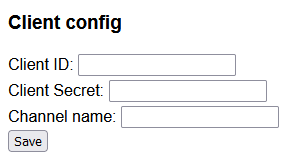
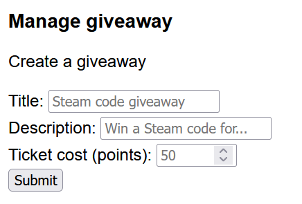
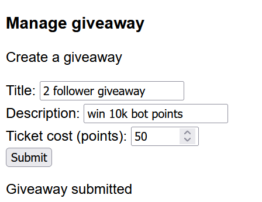
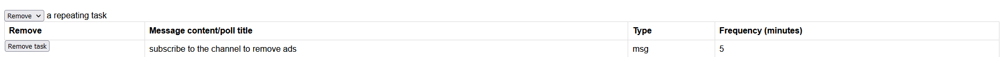
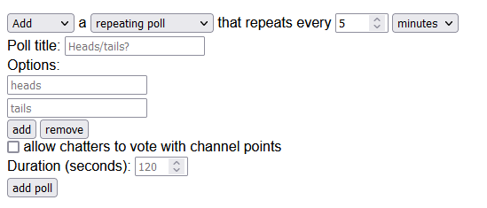
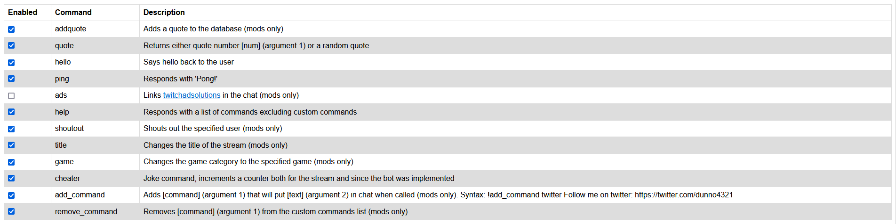
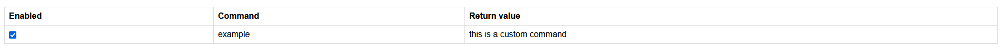

# YAGP(T)CB!
#### Yet another general purpose Twitch chatbot made by dunno4321. For questions, DM @dunno4321 on Discord


## Installation
You can either follow these steps to build & run it OR go to the Releases tab and download the .exe file and follow the instructions there
1. Download and install this by clicking (on GitHub) code --> download ZIP, and extract it to a known location
2. [Install Python](https://www.digitalocean.com/community/tutorials/install-python-windows-10)
3. [Install PIP](https://www.geeksforgeeks.org/how-to-install-pip-on-windows/#). It should install with Python, but it's better to check
4. Open File Explorer and navigate to this folder
5. In the address bar, type "cmd"
6. Type "`python -m pip install -r requirements.txt`" into Command Prompt. This will install the required libraries
    - If it returns something like "python is not recognized as a...", try running just `python` and install it from the Microsoft Store or try restarting your PC
7. When that has finished installing, follow [these steps](https://dev.twitch.tv/docs/authentication/register-app/) to create & register a bot and take note of your `client_id` and your `client_secret`
8. Set "OAuth Redirect URL" to "https://localhost:3000/token"
9. To connect with twitch, run the bot with `python main.py` and navigate to [https://localhost:3000](https://localhost:3000) in your web browser
10. Enter the client id, secret, and your channel name and click Save. All of this data is stored locally in assets/config.json
11. The bot should connect and print some information (the bot's username, user id, and connected channels)

## Running the bot
1. Open this folder in File Explorer
2. Type "cmd" into the address bar
3. Type `python main.py` into the command prompt
4. It will ask you to click the link to authorize the bot with Twitch
5. Click the link and follow the instructions to authorize the bot
6. The bot should connect and print some debug info about the username and user ID of the bot.
7. You should now be able to type !ping into your chat and have the bot respond with Pong!
8. If something doesn't work, go to assets/log.log and do a ctrl+F for "error" or DM me on Discord @dunno4321 with the log file
9. The web dashboard is located at [https://localhost:3000](https://localhost:3000)

## Commands

### !addquote [quote] (VIPs/Mods only)
- Adds a quote to the database. Stores quoter name, message, and date/time added
- All data can be found in the quotes.json file
- Syntax: `!addquote [quote]`
- Aliases: !add_quote, !aq

### !quote [num] (anyone)
- Displays quote [num] from the channel as follows:
- ```"{streamer} said '{msg}' on {added} (#{num}), as quoted by {quoter}"```
- e.x. "dunno4321 said 'test1' on 10/13/23 (#1), as quoted by dunno4321"
- If nothing is provided for [num], picks and displays a random quote
- Syntax: `!quote [num]`
- Aliases: !q

### !hello (anyone)
- Says hello back!

### !ping (anyone)
- Responds with Pong!

### !shoutout [user] (Mods only)
- Shouts out a user
- Syntax: `!shoutout [user]`
- Aliases: !so

### !title [title] (Mods only)
- Sets the stream title
- Syntax: `!title [title]`

### !game [game] (Mods only)
- Sets the game Twitch displays
- Syntax: `!game [game]`

### !add_command [command] [return] (Mods only)
- Adds a custom command that will put [return] in chat when called
- Syntax: `!addcmd [command] [return]`
- Example:
  - > `!addcmd twitter follow me on twitter @dunno4321`
  - > `Successfully added command!`
  - > `!twitter`
  - > `follow me on twitter @dunno4321`
- Advanced command syntax:
- {{by}} --> chatter that sent the message
- {{arg1}}, {{arg2}} --> arguments provided in the message calling the command
- {{random_a_b}} --> random number from a to b, inclusive
- {{channeltime}} --> channel local time
- {{increment_[counter]}} --> increments & displays a counter. Things like {{increment_bonk_{{arg1}}}} also work
- {{counter_[counter]}} --> displays a counter. Things like {{counter_bonk_{{arg1}}}} also work
- {{streamer}} --> channel name
- Examples:
- `!addcmd bonk {{by}} bonks {{arg1}}. ({{arg1}} has been bonked {{increment_bonk_{{arg1}}}} times)`
  -  > somedude: !bonk dunno4321
  -  > somedude bonks dunno4321 (dunno4321 has been bonked 1 times)
  -  > somedude: !bonk dunno4321
  -  > somedude bonks dunno4321 (dunno4321 has been bonked 2 times)
  -  > somedude: !bonk thestreamer
  -  > somedude bonks thestreamer (thestreamer has been bonked 1 times)
- `!addcmd time it is currently {{channeltime}} for {{streamer}}`
  - > somedude: !time
  - > it is currently 02:30 PM for dunno4321
- `!addcmd nerd {{by}} challenges {{arg1}} to a quick math battle: first to solve {{random_10_100}}*{{random_10_100}} wins!`
  - > somedude: !nerd dunno4321
  - > somedude challenges dunno4321 to a quick math battle: first to solve 67*94 wins!
- Aliases: !addcmd, !add_cmd, !addcommand

### !remove_command [command] (Mods only)
- Removes a custom command
- Syntax: `!remove_command [command]`
- Example:
  - > `!remove_command twitter`
  - > `Succesfully removed command twitter`
- Aliases: !remove_cmd, !removecmd, !rmvcmd, !rmv_cmd, !removecommand, !remove_cmd

### !watchtime
- Gives the watchtime of the chatter since the bot was implemented
- Syntax: `!watchtime`
- Example:
  - > `somedude: !watchtime`
  - > `somedude has spent 23 minutes watching dunno4321`
  - > `someotherdude: !watchtime`
  - > `someotherdude has spent 2 hours and 49 minutes watching dunno4321`
- Aliases: !wt

### !love [item]
- Calculates the love between the chatter and [item]
- Syntax: `!love [item]`
- Example:
  - > `somedude: !love cheese`
  - > `There is 69% love detected between somedude and cheese <3`
  - > `someotherdude: !love chatting`
  - > `There is 3% love detected between someotherdude and chatting <3`
- Aliases: !wt

### !8ball [question]
- Consult the 8ball!
- Syntax: `!8ball [question]`
- Example:
  - > `somedude: !8ball should i go to sleep`
  - > `My sources say no`
  - > `someotherdude: !8ball should I use my twitch prime on this streamer`
  - > `Without a doubt`
- Aliases: !eightball

### !syntax (Mods only)
- Gives the syntax on how to add an advanced custom command
- Syntax: `!syntax`
- Example:
  - > `agoodmod: !syntax`
  - > `{{by}} --> person who sent the message. {{arg1}}, {{arg2}} --> replaces with the arguments after the !{{command}}. {{random_a_b}} --> random int in [a, b]. {{channeltime}} --> streamer's local time. {{increment[counter_name]}} --> increments and replaces with a counter. {{counter_[counter_name]}} --> just the value of the counter. {{streamer}} --> channel name. Things like {{increment_bonk_{{arg1}}}} also work`
- Aliases: none

### !points
- Returns the amount of points the user has. Higher tier subs get more points
- Syntax: `!points [opt - user]`
- Example:
  - > `somedude: !points`
  - > `somedude has 20 points (#2)`
  - > `someotherdude: !points`
  - > `someotherdude has 50 points (#1)`
  - > `someotherdude: !points somedude`
  - > `somedude has 20 points (#2)`
- Aliases: !p

### !gamble [points]
- Gambles [points] points on random chance 
- Syntax: `!gamble [points]`
- Example (200 initial points for each):
  - > `somedude: !gamble 50`
  - > `somedude gambled 50 points and lost them all, resulting in 150 remaining points`
  - > `someotherdude: !gamble 50`
  - > `someotherdude gambled 50 points and won 150 points, resulting in 300 points total`
  - > `someotherdude: !gamble 250`
  - > `You only have 200 points to gamble!`
- Aliases: None

### !coinflip [points]
- Gambles [points] points on a coinflip
- Syntax: `!coinflip [points]`
- Example (200 initial points for each):
  - > `somedude: !coinflip 50`
  - > `somedude gambled 50 points and lost them all, resulting in 150 remaining points`
  - > `someotherdude: !coinflip 50`
  - > `someotherdude gambled 50 points and won, resulting in 250 points total`
  - > `someotherdude: !coinflip 250`
  - > `You only have 200 points to gamble!`
- Aliases: None

### !givepoints [user] [points]
- Gives [user] [points] points from the user's point amount
- Syntax: `!givepoints [user] [points]`
- Example:
  - > `somedude: !givepoints someotherdude 20`
  - > `Successfully gave someotherdude 20 points`
  - > `somedude: !givepoints someotherdude 500`
  - > `You only have 200 points to give!`
- Aliases: !gp, give_points

### !modgivepoints [user] [points] (Mods only)
- Gives [user] [points] points from the Mod Bank™
- Syntax: `!modgivepoints [user] [points]`
- Example:
  - > `somedude: !modgivepoints someotherdude 20`
  - > `<3 you don't have permission to use this command <3`
  - > `somemod: !modgivepoints someotherdude 500`
  - > `Successfully gave someotherdude 500 points`
- Aliases: !mgp, mod_give_points

### !takepoints [user] [points] (Mods only)
- Takes [points] points from [user]
- Syntax: `!takepoints [user] [points]`
- Example:
  - > `somedude: !takepoints someotherdude 20`
  - > `<3 you don't have permission to use this command <3`
  - > `somemod: !takepoints someotherdude 500`
  - > `someotherdude now has -300 points.`
- Aliases: !tp, take_points

### !leaderboard
- Shows the top 5 users in terms of points
- Syntax: `!leaderboard`
- Example:
  - > `somedude: !leaderboard`
  - > `#1: dunno4321: 1000 points, #2: somedude: 20 points, #3: someotherdude: -300 points, (etc)`
- Aliases: !lb

### !raffle
- Starts a raffle with up to 5 winners for 5000 bot points
- Syntax: `!raffle`
- Example:
  - > `somemod: !raffle`
  - > `New Multi-Raffle for 5000 points! Type !join to join! Ends in 30 seconds! PogChamp`
- Aliases: None

### !sraffle
- Starts a raffle with up 1 winner for 5000 bot points
- Syntax: `!sraffle`
- Example:
  - > `somemod: !sraffle`
  - > `New Single-Raffle for 5000 points! Type !join to join! PogChamp`
- Aliases: !singleraffle, !single_raffle

### !cancelraffle
- Cancels the currently running raffle
- Syntax: `!cancelraffle`
- Example:
  - > `somemod: !cancelraffle`
  - > `Raffle cancelled`
- Aliases: !cr, !cancel_raffle

### !join
- Joins the currently running raffle
- Syntax: `!join`
- Example:
  - > `somemod: !raffle`
  - > `New Multi-Raffle for 5000 points! Type !join to join! Ends in 30 seconds! PogChamp`
  - > `somedude: !join`
- Aliases: None

### !giveaway
- Returns info about the currently running giveaway
- Syntax: `!giveaway`
- Example:
  - `[giveaway active]`
  - > `somedude: !giveaway`
  - > `[the giveaway description]`
  - `[no giveaway active]`
  - > `somedude: !giveaway`
  - > `No active giveaway found!`
- Aliases: None

### !enter [ticket amount]
- Enters the currently running giveaway
- Syntax: `!enter [number of tickets/"max"]`
- Example:
  - `[giveaway active]`
  - > `somedude: !enter 5`
  - > `Successfully purchased 5 tickets for a total of 5 tickets`
  - `[no giveaway active]`
  - > `somedude: !enter 5`
  - > `No active giveaway found!`
- Aliases: !ticket

### !timer [minutes]
- Starts a timer for [minutes] minutes (80% working - to be fixed)
- Syntax: `!timer [minutes]`
  - Example:
    - > `somemod: !timer 5`
    - > `Created a 5 minute timer (timer #1)`
- Aliases: None

### !canceltimers
- Cancels all running timers
- Syntax: `!canceltimers`
  - Example:
    - > `somemod: !canceltimer`
    - > `Cancelled all running timers`
- Aliases: !canceltimer, !cts, !ct, !cancel_timer, !cancel_timers

## Web dashboard
- Go to [http://localhost:3000](http://localhost:3000) for the web configuration & things like repeating messages/polls
- Options:
  - Set client id, secret, and channel
    - 
  - Manage a giveaway
    - 
    - 
    - 
  - add/remove repeating messages/polls
    - 
    - 
  - enable/disable default commands
    - 
  - enable/disable custom commands
  - 

## Debugging
- Check log.log (do a ctrl+f for "error") and/or DM me on Discord with the log file

## Todos:
- custom point redeems (v2.4?)
- organize all .json into one .json? (v2.4? v3.0?)
- comment the code, dangit
- Websockets to handle subscriptions & whatnot (needs outward-facing IP - repl.it? port forwarding?)
